# (C# 코딩) 나만의 계산기

## 목차
1. 개요
2. 과제 1
3. 과제 2
4. 과제 3
5. 과제 4

---

## 1. 개요
본 실습은 C# Windows Forms(.NET 8) 환경에서 심플 사칙연산기를 구현하는 과제이다. Visual Studio 2026을 사용하여 버튼 클릭 이벤트와 TextBox 출력 방식을 익히고, 1단계에서는 덧셈, 2단계에서는 뺄셈·곱셈·나눗셈, 3단계에서는 C, CE, Del 기능까지 확장하여 계산기의 기본 기능을 단계적으로 완성하였다.

---

## 2. 과제 1

### 실행 화면

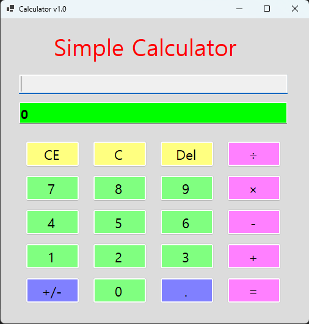

 1. 프로그램 실행 시 기본 화면으로, 입력창과 결과창 그리고 숫자 및 연산 버튼이 배치된 상태이다.

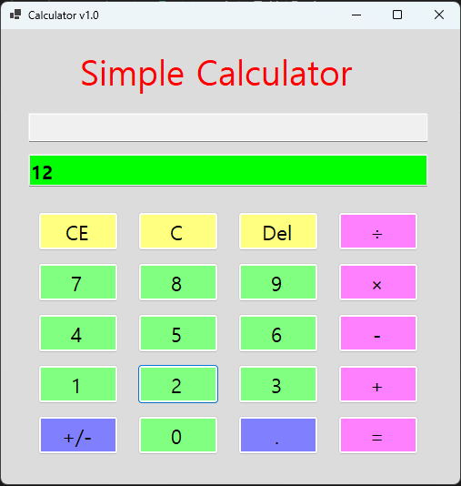

 2. 숫자 버튼을 클릭하면 입력값이 TextBox에 표시되며, 사용자가 입력한 값이 누적되어 나타난다.

 3. '+' 버튼을 클릭하면 첫 번째 피연산자와 연산자가 상단 입력창에 표시되어 계산 준비 상태가 된다.

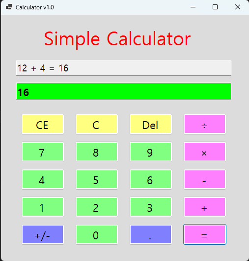

 4. 두 번째 숫자를 입력한 후 '=' 버튼을 누르면 계산 결과가 출력창에 표시된다.

### 과제 1 설명
Windows Forms Designer를 활용하여 계산기 UI를 구성하고 버튼 클릭 이벤트로 숫자 입력과 덧셈 기능을 구현하였다. 입력값은 int.Parse로 변환하고 결과는 ToString으로 출력하며, 두 개의 TextBox로 수식과 결과를 구분하여 표시하도록 구성하였다.

---

## 3. 과제 2

### 실행 화면

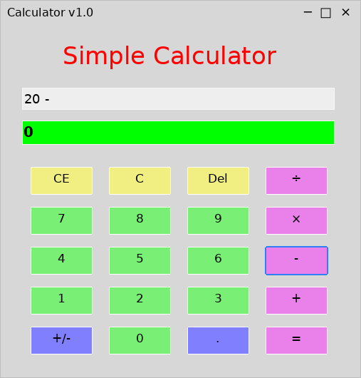

 1. 숫자를 입력한 뒤 '-' 버튼을 클릭하면 첫 번째 피연산자와 연산자가 상단 입력창에 표시되어 뺄셈 계산 준비 상태가 된다.

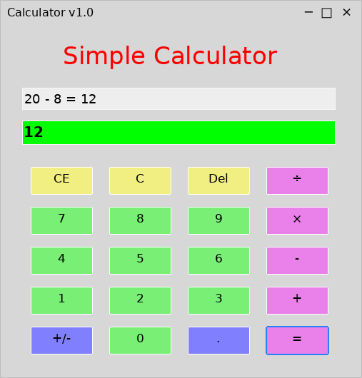

 2. 두 번째 숫자를 입력하고 '=' 버튼을 누르면 뺄셈 결과가 상단 식과 하단 결과창에 함께 표시된다.

 3. '×' 버튼을 이용하여 곱셈 연산을 수행할 수 있으며, 계산식과 결과가 각각의 TextBox에 출력된다.

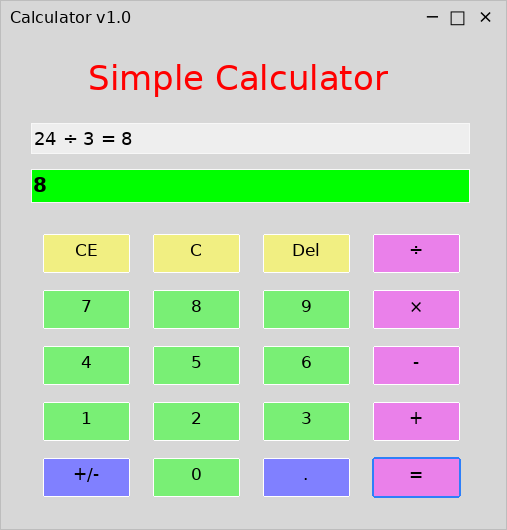

 4. '÷' 버튼을 이용하여 나눗셈 연산을 수행할 수 있으며, 사칙연산 공통 로직으로 결과가 계산되어 표시된다.

### 과제 2 설명
과제 2에서는 1단계에서 구현한 덧셈 구조를 그대로 활용하여 뺄셈, 곱셈, 나눗셈 버튼을 추가하였다. 각 연산 버튼은 동일한 이벤트 흐름을 공유하고, 선택된 연산자에 따라 계산 로직만 달라지도록 구성하여 사칙연산 기능을 완성하였다.

---

## 4. 과제 3

### 실행 화면

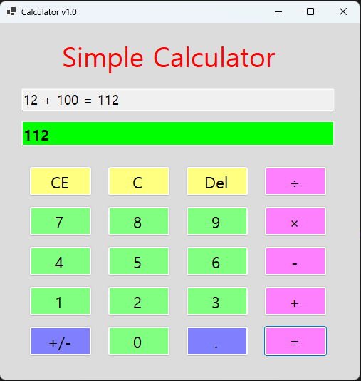

 1. 12 + 100 = 112 사례를 통해 기능 동작 확인

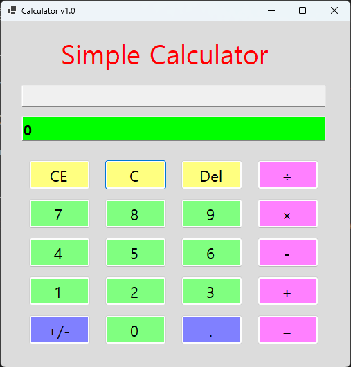

 2. 'C' 버튼을 누르면 입력 중인 값, 연산자, 결과를 모두 삭제하고 처음 상태로 되돌아간다.

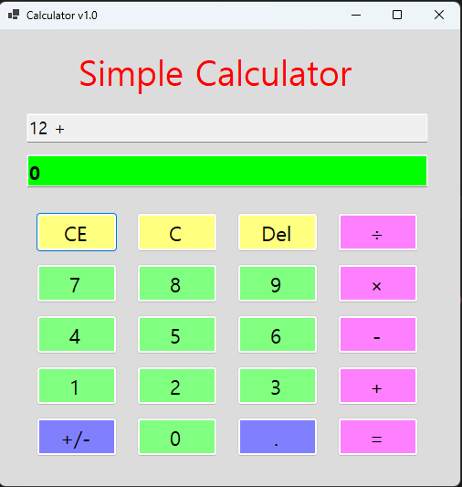

 3. 'CE' 버튼을 누르면 마지막 입력한 피연산자 값이 통째로 삭제되어 현재 입력창이 0으로 초기화된다.

 4. 'Del' 버튼을 누르면 마지막에 입력한 숫자 한 글자만 삭제되어 예를 들어 100이 10으로 변경된다.

### 과제 3 설명
과제 3에서는 계산기의 수정 기능인 C, CE, Del 버튼을 구현하였다. C는 전체 계산 상태를 초기화하고, CE는 마지막 피연산자를 통째로 삭제하며, Del은 마지막 숫자 한 글자만 지우도록 구성하여 입력 내용을 상황에 맞게 수정할 수 있도록 하였다.

---

## 5. 과제 4

## 실행 화면

1. +/- 버튼을 눌러 현재 입력값의 부호를 양수와 음수로 전환하여 계산하는 화면입니다.

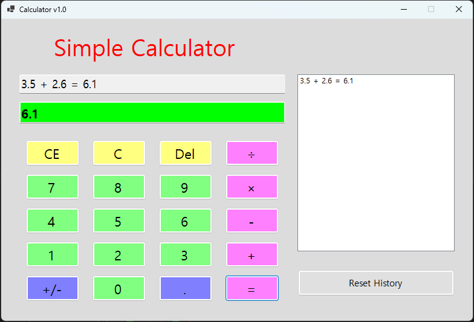

2. . 버튼을 눌러 소수점을 입력하고 실수 계산을 하는 화면입니다.

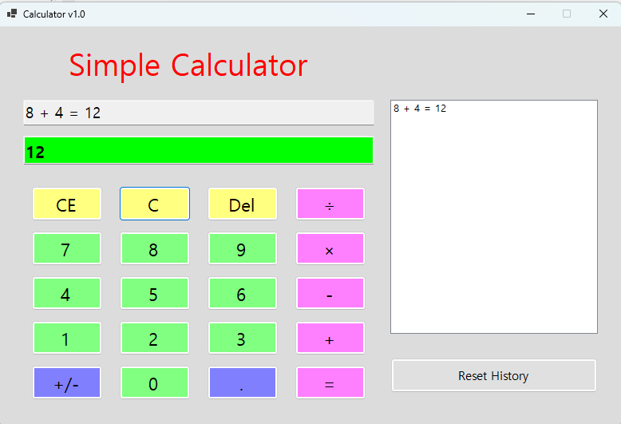

3. 키보드 숫자 키를 눌러 마우스 클릭 없이 값을 계산하는 화면입니다.

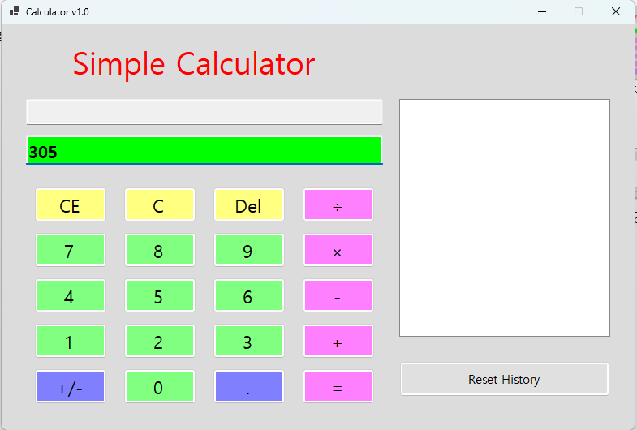

4. Backspace로 한 글자 삭제하는 화면입니다.

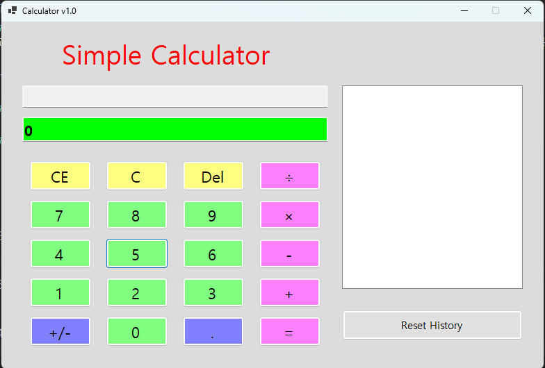

5. Escape로 전체 초기화를 수행하는 화면입니다.

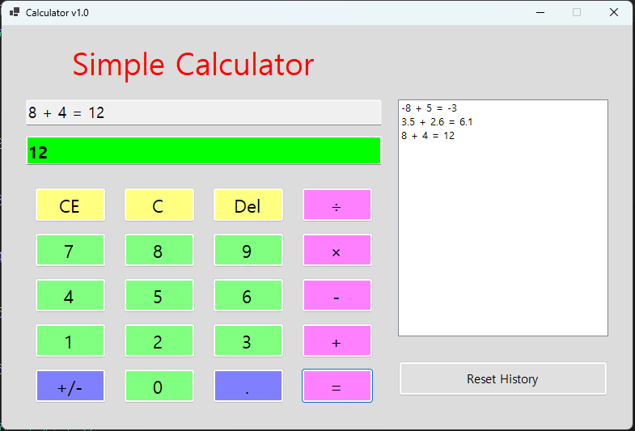

6. 계산이 완료될 때마다 오른쪽 ListBox에 수식과 결과가 기록되는 화면입니다.

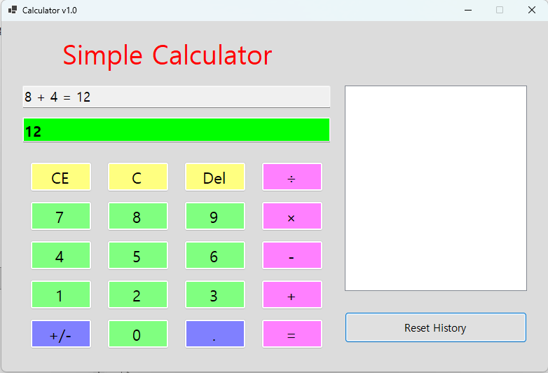

7. Reset History 버튼을 눌러 저장된 계산 기록을 모두 삭제하는 화면입니다.

## 과제4 설명
과제 4에서는 계산기를 더 쉽고 편하게 사용할 수 있도록 기능을 확장하였다. +/- 버튼으로 부호를 바꾸고 . 버튼으로 소수점을 입력할 수 있게 하였다. 키보드의 숫자, 연산자, Enter, Backspace, Escape를 연결하여 마우스 없이도 계산할 수 있게 하였다. ListBox를 추가해 계산 기록을 저장하고 Reset History 버튼으로 기록을 한 번에 지울 수 있도록 구현하였다.
